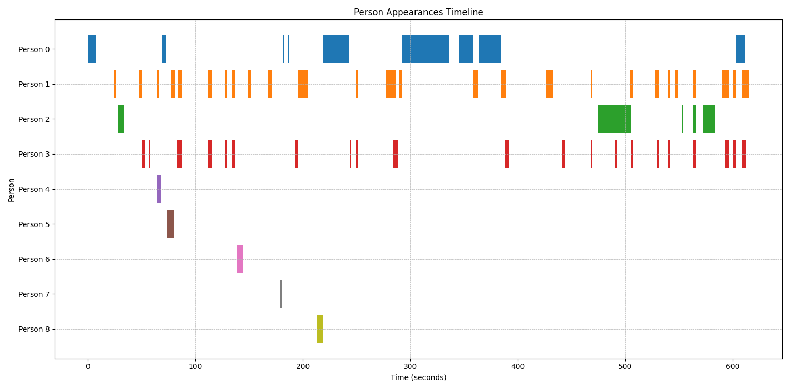

# 동영상 얼굴 클러스터링 및 클립 생성기 (Video Face Clustering & Clip Generator)

이 프로젝트는 동영상에 등장하는 인물들의 얼굴을 자동으로 인식하고, 동일 인물별로 등장하는 장면을 찾아 별도의 비디오 클립으로 만들어주는 파이썬 스크립트입니다.

`face_recognition` 라이브러리로 얼굴을 탐지 및 인코딩하고, `scikit-learn`의 DBSCAN 알고리즘을 사용하여 비슷한 얼굴들을 그룹화(클러스터링)합니다. 마지막으로 `ffmpeg`을 이용해 각 인물별 등장 구간을 동영상 클립으로 추출합니다.

## 주요 기능

- **자동 인물 분류**: 동영상 속 여러 인물들을 자동으로 구별하여 그룹화합니다.
- **대표 얼굴 추출**: 각 인물 그룹별로 대표 얼굴 이미지를 생성하여 쉽게 인물을 식별할 수 있도록 합니다.
- **클립 자동 생성**: 인물별로 등장하는 모든 장면을 찾아 각각의 비디오 클립으로 저장합니다.
- **타임라인 시각화**: 각 인물의 등장 시간을 한눈에 파악할 수 있는 시각화된 타임라인 이미지를 생성합니다.
- **유연한 설정**: 프레임 샘플링 속도, 클러스터링 민감도 등 주요 파라미터를 스크립트 내에서 쉽게 조절할 수 있습니다.

## 결과물 예시

프로젝트를 실행하면 `output_clips` 디렉토리에 아래와 같은 구조로 결과가 저장됩니다.

```
output_clips/
├── person_0/
│   ├── representative_face.jpg
│   ├── clip_1.mp4
│   └── clip_2.mp4
├── person_1/
│   ├── representative_face.jpg
│   ├── clip_1.mp4
│   ├── clip_2.mp4
│   └── ...
└── timeline.png  <-- 새로 추가된 타임라인 시각화 이미지
```

**타임라인 시각화 이미지 예시:**




## 설치 및 실행 방법

### 1. FFmpeg 설치

이 프로젝트는 동영상 처리를 위해 **FFmpeg**가 필요합니다. 사용 중인 운영체제에 맞게 먼저 설치해주세요.

- **Ubuntu/Debian**:
  ```bash
  sudo apt update
  sudo apt install ffmpeg
  ```
- **macOS** (Homebrew 사용):
  ```bash
  brew install ffmpeg
  ```
- **Windows**:
  - [FFmpeg 공식 홈페이지](https://ffmpeg.org/download.html)에서 빌드를 다운로드 받은 후, 시스템 환경 변수 `Path`에 FFmpeg 실행 파일이 있는 `bin` 폴더 경로를 추가해야 합니다.

### 2. 프로젝트 복제 및 파이썬 라이브러리 설치

```bash
# 1. 이 저장소를 복제(clone)합니다.
git clone https://github.com/BigJoon/face_cluster.git
cd face_cluster

# 2. 가상 환경을 생성하고 활성화합니다. (권장)
python -m venv venv
source venv/bin/activate  # Linux/macOS
# venv\Scripts\activate  # Windows

# 3. 필요한 파이썬 라이브러리를 설치합니다.
pip install -r requirements.txt
```

**참고:** `face-recognition` 라이브러리는 `dlib`에 의존하며, 시스템에 따라 C++ 컴파일러나 `cmake` 등이 필요할 수 있습니다. 설치 중 오류가 발생하면 [face-recognition 설치 가이드](https://github.com/ageitgey/face_recognition#installation)를 참고하여 `dlib`을 먼저 설치해보세요.

### 3. 동영상 준비

프로젝트 루트 디렉토리에 `input_video` 폴더를 만들고, 분석하고 싶은 동영상 파일 (mp4, mov, avi 등)을 넣어주세요.

```
/face_cluster
├── input_video/
│   └── my_awesome_video.mp4  <-- 여기에 동영상 추가
├── output_clips/
├── cluster_faces_video.py
└── ...
```

### 4. 스크립트 실행

모든 준비가 완료되었으면 아래 명령어로 스크립트를 실행합니다.

```bash
python cluster_faces_video.py
```

스크립트가 실행되면 터미널에 진행 상황이 출력되며, 작업이 끝나면 `output_clips` 폴더에 결과물이 생성됩니다.

## 설정값 조정

분석의 정밀도나 방식을 변경하고 싶다면 `config.py` 파일을 직접 수정하세요. 각 설정값에 대한 설명은 파일 내 주석을 참고하시면 됩니다.

```python
# config.py

# 입출력 폴더 경로
INPUT_VIDEO_DIR = "input_video"       # 분석할 동영상이 있는 폴더
OUTPUT_CLIPS_DIR = "output_clips"     # 결과물(클립, 대표얼굴)이 저장될 폴더

# 얼굴 클러스터링(DBSCAN) 설정
DBSCAN_EPS = 0.35                     # 얼굴 인코딩 간의 최대 거리. 작을수록 동일 인물에 대한 판단이 엄격해집니다.
DBSCAN_MIN_SAMPLES = 7                # 하나의 인물 클러스터를 형성하기 위해 필요한 최소 얼굴 샘플 수

# 동영상 처리 설정
FRAME_SAMPLING_RATE = 2               # 초당 분석할 프레임 수. 높이면 정확도가 올라가지만 분석 시간이 오래 걸립니다.
CLIP_MERGE_TOLERANCE_SEC = 2.5        # 같은 인물의 등장 구간을 하나로 합칠 때 허용할 최대 시간 간격(초)입니다.
```

- `DBSCAN_EPS`: 값이 낮을수록 동일 인물이라고 판단하는 기준이 엄격해집니다.
- `DBSCAN_MIN_SAMPLES`: 한 인물로 인정받기 위해 필요한 최소 얼굴 검출 횟수입니다. 노이즈를 줄이려면 값을 높이세요.
- `FRAME_SAMPLING_RATE`: 초당 분석할 프레임 수입니다. 높이면 정확도가 올라가지만 분석 시간이 길어집니다.
